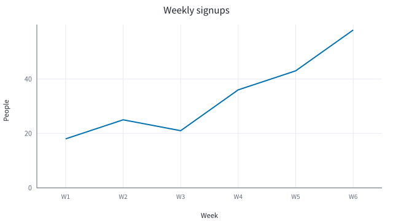
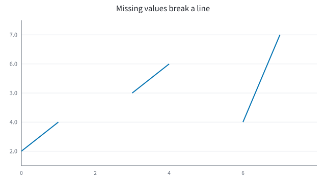
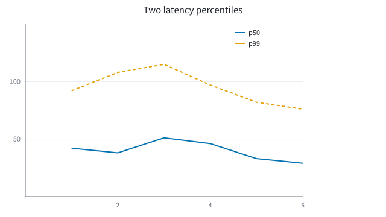
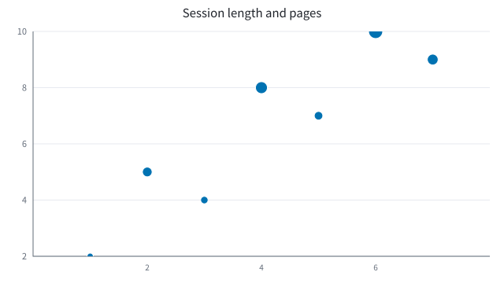
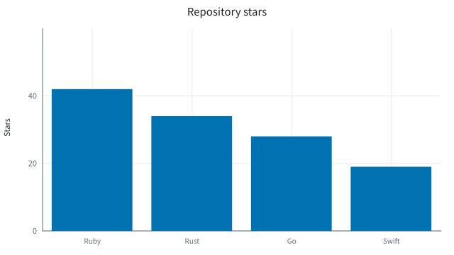
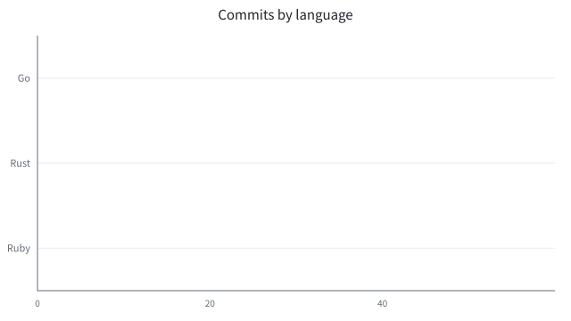
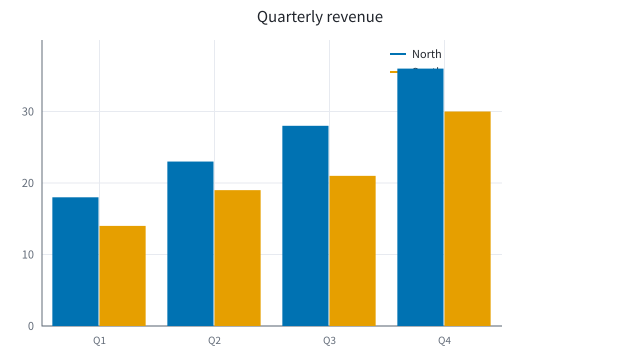
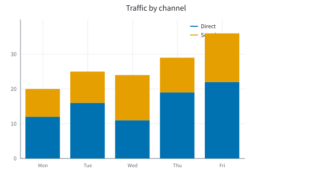
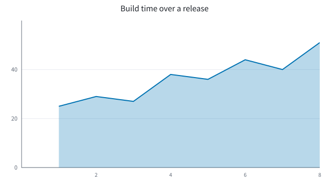
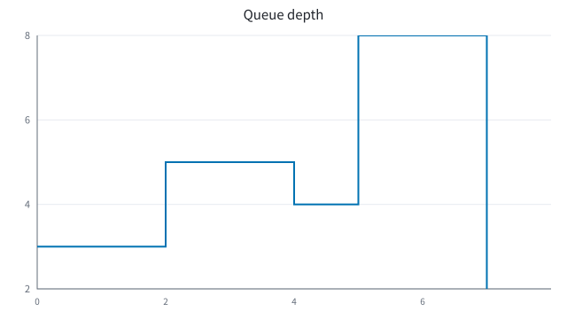

# Inkplot gallery

Generated by [`../gallery.rb`](../gallery.rb). Run `ruby examples/gallery.rb` from the repository root to refresh the SVG previews.

| Example | Preview | Example | Preview |
|---|---|---|---|
| Line |  | Gaps |  |
| Series |  | Scatter |  |
| Bars |  | Horizontal bars |  |
| Grouped bars |  | Stacked bars |  |
| Area |  | Step |  |
